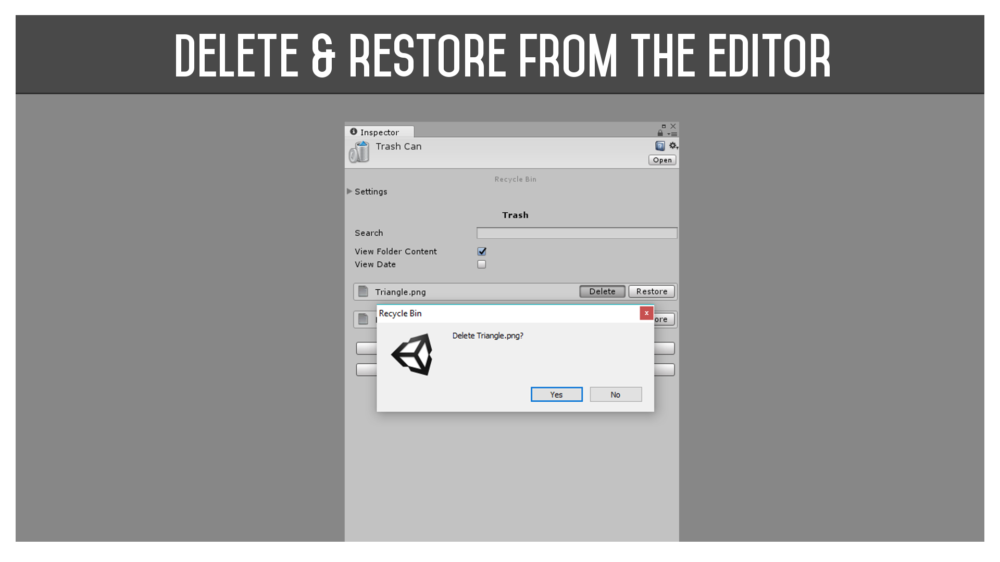
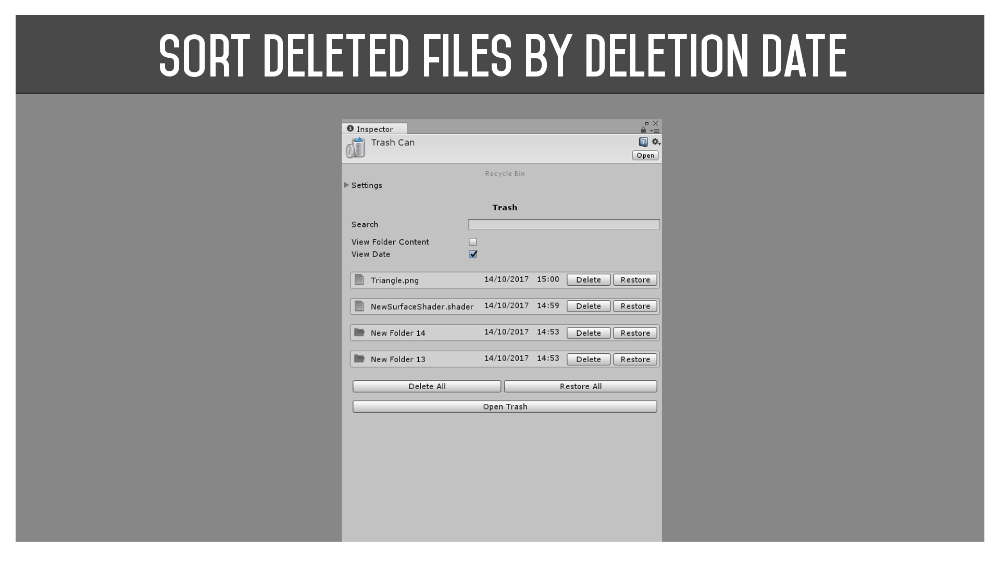
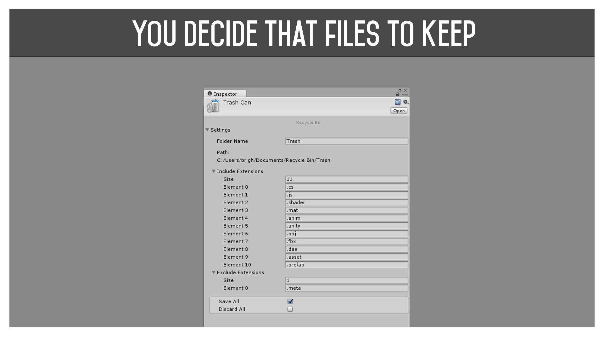
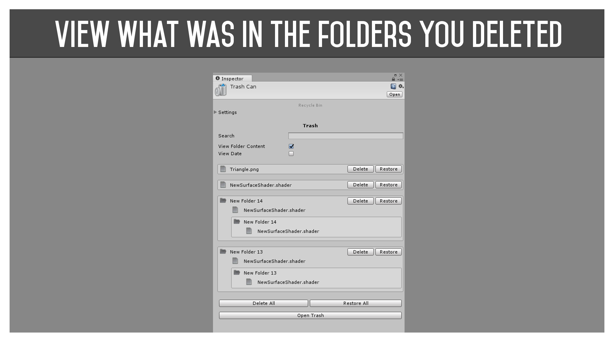
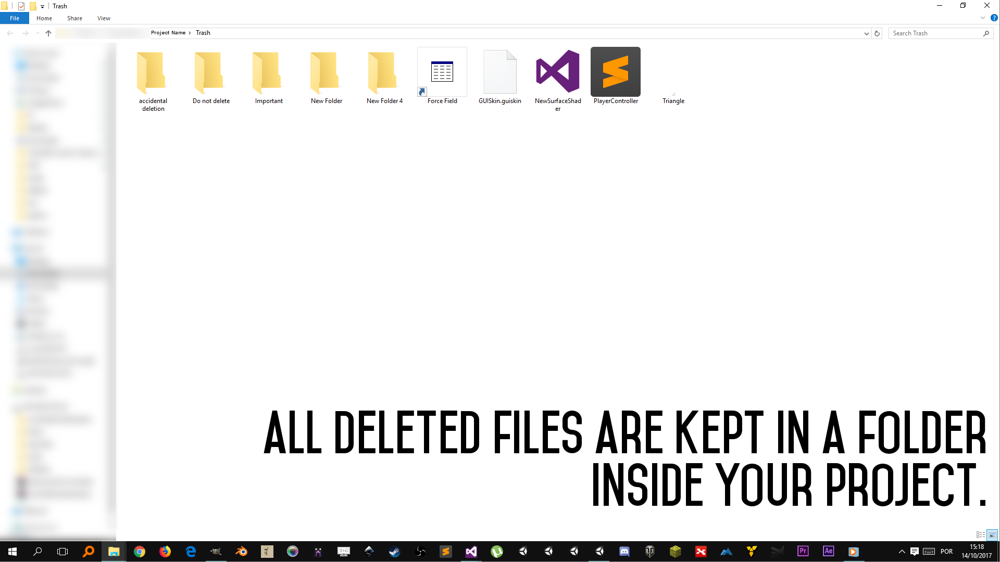
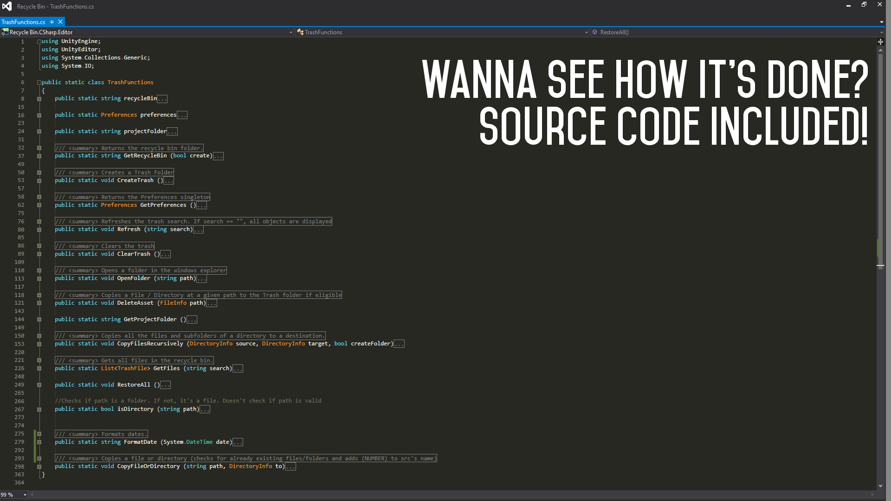

# Recycle-Bin

Did this project over a few weeks as practice of advanced editor scripting in Unity.
Overrides the OnFileDelete(notactualname) function and if the file to be deleted matches the preset parameters the file gets copied to a special recycle bin folder instead of being deleted. You can then view and restore deleted files in the editor.

Here are a few images that I was making for the asset store:

# Consider buying me a coffee if you like my work (click the image)

